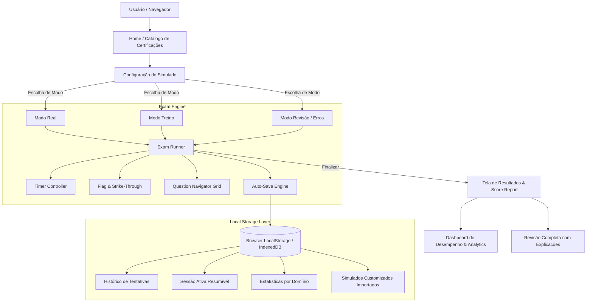

# 📋 Plano Arquitetural e de Implementação: AWS Exam Simulator

## 1. Visão Geral do Projeto

O **AWS Exam Simulator** é uma aplicação web estática (Next.js 15 + React 19 + Tailwind CSS) projetada para preparar candidatos para exames oficiais da AWS (como CLF-C02, SAA-C03, DVA-C02, SAP-C02, entre outros). A aplicação funciona 100% no cliente (client-side), persistindo progresso, respostas e histórico de desempenho diretamente no armazenamento local do navegador (`localStorage` / `IndexedDB`), sem dependência de backend, mantendo compatibilidade total com o deploy estático em S3 + CloudFront.

---

## 2. Arquitetura do Sistema



---

## 3. Funcionalidades Principais

### 3.1. Modos de Teste
| Modo | Descrição | Comportamento do Gabarito | Timer | Navegação |
| :--- | :--- | :--- | :--- | :--- |
| **Simulado Real** | Experiência idêntica ao exame oficial (Pearson VUE) | Exibido apenas no final após submissão | Regressivo fixo (ex: 90min/130min) com alertas | Livre com tela de revisão final antes de submeter |
| **Modo Treino (Estudo)** | Focado em aprendizado contínuo | Feedback e explicações imediatas ao responder/confirmar | Opcional (progressivo, regressivo ou desativado) | Livre, permite refazer e testar |
| **Modo Revisão de Erros** | Prática direcionada nas questões erradas ou marcadas | Imediato ou final | Livre | Questões filtradas de tentativas anteriores |

---

### 3.2. Interface e Ferramentas do Exame (Estilo Exame Oficial)
- ⏱️ **Timer Inteligente**:
  - Contagem regressiva oficial ou progressiva.
  - Alerta visual aos 15 minutos e 5 minutos restantes.
  - Pausa de emergência (apenas no modo treino).
- 🚩 **Flag (Marcar para Revisão)**:
  - Marcação visual para voltar a questões duvidosas.
- 🚫 **Strike-through (Riscador de Alternativas)**:
  - Permite riscar/eliminar alternativas incorretas visualmente com um clique ou atalho, facilitando o processo de eliminação.
- 🗂️ **Grid Navegador de Questões (Question Map)**:
  - Painel lateral/modal com status visual de cada questão: *Não Respondida*, *Respondida*, *Marcada (Flagged)*, *Atual*.
- 📝 **Bloco de Anotações (Scratchpad / Notes)**:
  - Anotações por questão salvas na sessão.
- 💾 **Auto-Save & Resume**:
  - A cada resposta ou marcação, o estado é gravado. Se a página for recarregada ou fechada, o usuário pode retomar de onde parou.
- 🌗 **Temas Visuais**:
  - Tema Moderno (Clean Dark/Light) e Tema Pearson VUE (fiel ao teste real).

---

### 3.3. Tipos de Questões Suportados
1. **Single Choice (Múltipla Escolha - 1 correta)**: Botões de rádio clássicos.
2. **Multiple Response (Múltipla Seleção - 2 ou mais corretas)**: Checkboxes com indicação clara (*"Selecione DUAS opções"* ou *"Selecione TRÊS opções"*), com validação da quantidade exigida.

---

### 3.4. Relatório de Desempenho & Analytics
- **Pontuação AWS Oficial**: Conversão e cálculo escalado (ex: escala 100 a 1000 pontos, nota de corte oficial 700 ou 720).
- **Desempenho por Domínio**: Gráficos e porcentagens por domínio oficial da certificação (ex: *Domain 1: Cloud Concepts*, *Domain 2: Security*, etc.).
- **Revisão Detalhada**:
  - Filtro por: Todas, Apenas Corretas, Apenas Incorretas, Marcadas.
  - Explicação aprofundada de **por que** a opção correta é a certa e **por que** cada opção incorreta está errada.
  - Links de referência para documentação oficial da AWS e Whitepapers.
- **Histórico Geral**:
  - Gráfico de evolução de notas ao longo do tempo.
  - Taxa de acerto acumulada por serviço (ex: S3, DynamoDB, Lambda, IAM, VPC).

---

### 3.5. Gerenciamento e Adição de Novos Simulados (AI & Git Friendly)
- **Zero Complexidade de UI**: Sem telas complexas de importação/exportação no navegador; todos os simulados ficam versionados no repositório.
- **Formato Padronizado (JSON Schema)**: Cada simulado é um arquivo `.json` independente e auto-contido dentro de `src/data/exams/` (ex: `sap-c02.json`, `dva-c02.json`).
- **Prompt Oficial para IAs (`.agent/AI_PROMPT_TEMPLATE.md`)**: Um template pronto de prompt para você simplesmente pedir a qualquer IA para gerar um simulado completo no formato exato esperado.
- **Validador Automático (`npm run validate:exams`)**: Script CLI que valida integridade (se as respostas corretas batem com as opções, se os domínios batem, se os IDs são únicos) antes do commit.
- **Auto-registro**: A aplicação descobre e lista automaticamente qualquer simulado adicionado à pasta `src/data/exams/`.

---

## 4. Estrutura de Dados e Esquema TypeScript

### 4.1. Esquema da Questão (`Question`)
```typescript
export type QuestionType = 'single' | 'multiple';

export interface QuestionOption {
  id: string; // "A", "B", "C", "D", "E"
  text: string;
  explanation?: string; // Por que esta opção está certa ou errada
}

export interface Question {
  id: string;
  examId: string; // Ex: "CLF-C02", "SAA-C03"
  domainId: string; // Ex: "domain-1-cloud-concepts"
  domainName: string; // "Cloud Concepts"
  services?: string[]; // ["S3", "CloudFront", "IAM"]
  type: QuestionType;
  requiredChoices: number; // 1 para single, 2+ para multiple
  statement: string;
  options: QuestionOption[];
  correctAnswers: string[]; // ["A"] ou ["B", "D"]
  generalExplanation: string;
  referenceUrl?: string;
  difficulty?: 'easy' | 'medium' | 'hard';
}
```

### 4.2. Esquema do Exame e Certificação (`ExamDefinition`)
```typescript
export interface DomainDefinition {
  id: string;
  name: string;
  weightPercentage: number; // Ex: 24 (24% da prova)
}

export interface ExamDefinition {
  id: string; // "CLF-C02"
  title: string; // "AWS Certified Cloud Practitioner"
  code: string; // "CLF-C02"
  category: 'Foundational' | 'Associate' | 'Professional' | 'Specialty';
  description: string;
  totalQuestions: number; // Ex: 65
  timeLimitMinutes: number; // Ex: 90
  passingScore: number; // Ex: 700 (escala 100-1000)
  domains: DomainDefinition[];
  icon: string;
  questions: Question[];
}
```

### 4.3. Esquema de Sessão de Tentativa (`ExamAttempt`)
```typescript
export interface QuestionUserResponse {
  questionId: string;
  selectedOptionIds: string[];
  struckOutOptionIds: string[]; // Alternativas riscadas
  isFlagged: boolean;
  notes?: string;
  isCorrect?: boolean;
  timeSpentSeconds: number;
}

export interface ExamAttempt {
  id: string;
  examId: string;
  examCode: string;
  examTitle: string;
  mode: 'real' | 'practice' | 'review';
  startedAt: string;
  completedAt?: string;
  timeRemainingSeconds: number;
  totalTimeSpentSeconds: number;
  isCompleted: boolean;
  responses: Record<string, QuestionUserResponse>;
  score?: {
    scaledScore: number; // 100-1000
    percentage: number; // 0-100%
    passed: boolean;
    totalCorrect: number;
    totalQuestions: number;
    domainBreakdown: Record<string, {
      domainName: string;
      total: number;
      correct: number;
      percentage: number;
    }>;
  };
}
```

---

## 5. Estrutura de Diretórios Proposta

```
src/
├── app/
│   ├── layout.tsx                    # Layout geral com Providers e Navbar
│   ├── page.tsx                      # Dashboard inicial / Catálogo de Certificações
│   ├── exams/
│   │   └── [examId]/
│   │       ├── page.tsx              # Detalhes da certificação & Seleção de Modo
│   │       ├── runner/
│   │       │   └── page.tsx          # Tela de Execução do Simulado
│   │       └── result/[attemptId]/
│   │           └── page.tsx          # Relatório de Resultado & Revisão
│   ├── history/
│   │   └── page.tsx                  # Histórico Geral de Desempenho e Estatísticas
│   └── globals.css
├── components/
│   ├── common/
│   │   ├── Header.tsx                # Barra de navegação superior
│   │   ├── Badge.tsx
│   │   ├── Modal.tsx
│   │   └── ProgressBar.tsx
│   ├── dashboard/
│   │   ├── ExamCard.tsx              # Card da certificação no catálogo
│   │   ├── PerformanceChart.tsx      # Gráfico de evolução de notas
│   │   ├── DomainRadar.tsx           # Gráfico de radar/barras por domínio
│   │   └── RecentAttemptsTable.tsx   # Tabela de tentativas recentes
│   ├── exam/
│   │   ├── ExamHeader.tsx            # Header do exame com Timer, progresso e ações
│   │   ├── QuestionView.tsx          # Exibição do enunciado e opções
│   │   ├── OptionCard.tsx            # Opção individual com suporte a strike-through
│   │   ├── QuestionGridModal.tsx     # Mapa de questões com status
│   │   ├── InstantFeedback.tsx       # Explicação no Modo Treino
│   │   ├── StrikeThroughButton.tsx   # Ferramenta para riscar alternativas
│   │   ├── ScratchpadModal.tsx       # Bloco de anotações da questão
│   │   └── ExamReviewScreen.tsx      # Tela de revisão final antes de submeter
│   └── results/
│       ├── ScoreCard.tsx             # Nota final (Aprovado/Reprovado + Score 100-1000)
│       ├── DomainBreakdownList.tsx   # Desempenho detalhado por domínio
│       └── QuestionReviewList.tsx    # Listagem de questões com filtros e gabarito
├── data/
│   ├── exams/
│   │   ├── _template.json            # Modelo oficial para criar novos simulados
│   │   ├── sap-c02.json              # Banco de questões AWS Solutions Architect - Professional
│   │   ├── saa-c03.json              # Banco de questões AWS Solutions Architect - Associate
│   │   ├── clf-c02.json              # Banco de questões AWS Cloud Practitioner
│   │   └── index.ts                  # Registro e loader central de simulados
├── hooks/
│   ├── useExamEngine.ts              # Hook do motor de execução do exame
│   ├── useTimer.ts                   # Hook de controle do timer e alertas
│   └── useLocalStorage.ts           # Hook de sincronização de estado
├── lib/
│   ├── storage/
│   │   ├── examStorage.ts            # Gerenciamento de tentativas e sessões locais
│   │   └── analyticsStorage.ts       # Agregação de estatísticas do usuário
│   ├── scoreCalculator.ts            # Cálculo de score escalado e por domínio
│   └── utils.ts
├── scripts/
│   └── validate-exams.ts             # Script CLI que valida qualquer novo simulado
└── types/
    └── exam.ts                       # Tipos TypeScript centralizados
```

---

## 6. Fases de Desenvolvimento

### Fase 1: Fundação, Tipos, Template Padronizado e Validador
- Criar tipos TypeScript completos (`Question`, `ExamDefinition`, `ExamAttempt`, etc.).
- Criar template oficial `src/data/exams/_template.json` e guia de prompt `.agent/AI_PROMPT_TEMPLATE.md`.
- Criar script de validação `scripts/validate-exams.ts` (`npm run validate:exams`).
- Implementar bancos de dados com exames reais estruturados com foco prioritário em **SAP-C02** (Solutions Architect Professional), além de **SAA-C03** e **CLF-C02**.
- Instalar dependências visuais úteis (`lucide-react`, `canvas-confetti`).

### Fase 2: Camada de Armazenamento Local e Lógica de Cálculo de Score
- Implementar `examStorage.ts` (salvamento de tentativas, sessões ativas com auto-save e histórico).
- Implementar `scoreCalculator.ts` (cálculo ponderado de score 100-1000, taxa de acerto e agrupamento por domínio).

### Fase 3: Motor de Exame (Exam Engine) e Interface do Simulado
- Criar `ExamHeader` com Timer regressivo/progressivo e contador de progresso.
- Criar `QuestionView` com suporte a escolha única e múltipla seleção ("Choose TWO/THREE").
- Adicionar funcionalidade de **Strike-through** (riscar alternativas) e **Flag** (marcar para revisão).
- Criar o **Question Grid Navigator** para visão global e salto rápido entre questões.
- Implementar o **Modo Treino** com botão de verificação e explicações imediatas.
- Implementar a **Tela de Revisão Final** antes de enviar o simulado no Modo Real.
- Implementar **Atalhos de Teclado** (`A`-`E`, `F`, `Setas`, etc.).
- Implementar alternância de tema (**AWS Console Moderno** vs **Pearson VUE Clássico**).

### Fase 4: Tela de Resultados, Revisão e Dashboard
- Criar página de resultado com selo Aprovado/Reprovado, pontuação escalada e breakdown por domínio.
- Criar visualizador de revisão detalhada com filtros (todas, erradas, certas, marcadas) e explicações.
- Criar Dashboard inicial com lista de certificações, progresso e histórico de tentativas.

### Fase 5: Recursos Extras e Refinamento
- Modo de revisão direcionado (refazer apenas questões erradas ou marcadas).
- Polimento de acessibilidade e responsividade mobile.


---

## 7. Decisões de Design Alinhadas

1. **Estilo Visual**: Interface Moderna e elegante (AWS Console Dark/Light) com botão de alternância em tempo real para o layout clássico **Pearson VUE**.
2. **Atalhos de Teclado**: Habilitados durante o exame (`A`-`E` para selecionar opções, `F` para marcar Flag, `X` para Strike-through, `Seta Direita`/`Seta Esquerda` para navegar).
3. **Bancos de Questões Iniciais**:
   - **AWS Certified Solutions Architect - Professional (SAP-C02)** *(Prioridade do usuário)*
   - **AWS Certified Solutions Architect - Associate (SAA-C03)**
   - **AWS Certified Cloud Practitioner (CLF-C02)**
4. **Armazenamento 100% Local**: `localStorage` com suporte a backup/exportação/importação JSON.

